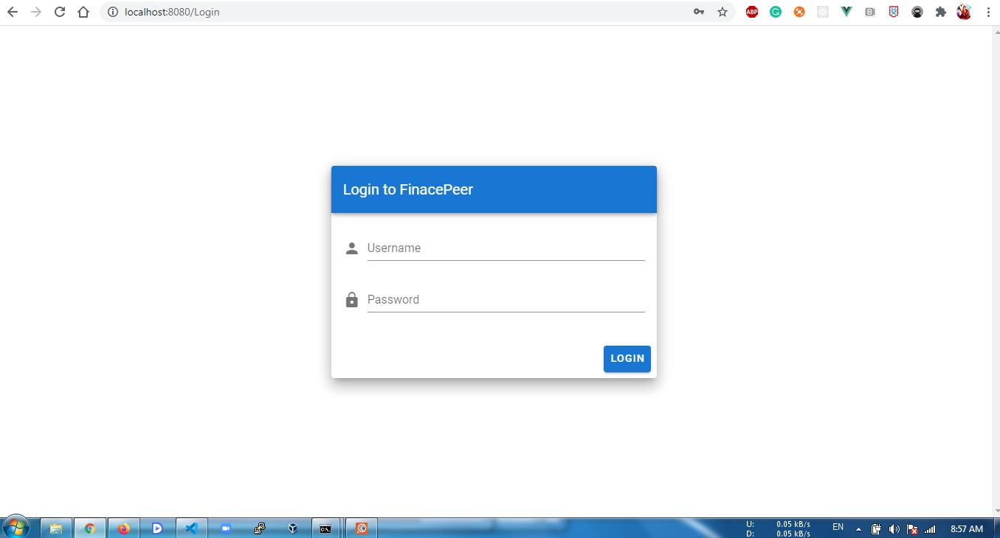
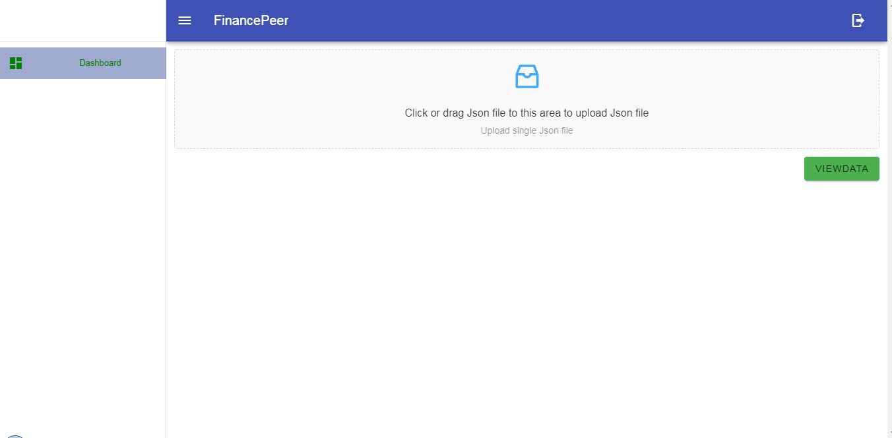
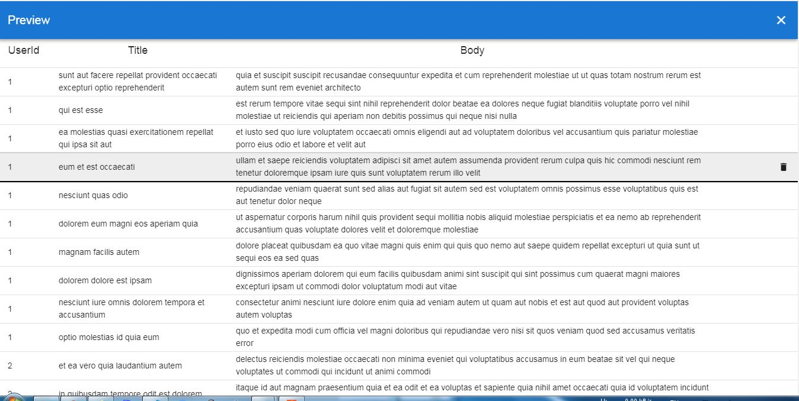

# Instructions


Please follow below steps.

  - run the django defualt runserver
  - I kept dist folder, if needed please install nodemodules
  - I tried to launch the dist index.html and static via django, but one from js and another from css, not able to load you can see the same in urls
  - I recommend to install globally npm install -g serve and below cmd being in directory where all src and dist etc.. present
  ```sh
$ serve -s dist
```
  - Created username=admin password=admin123
  - Please feel free to use createsuperuser cmd to create own usercredentials
  
# Technology Stack
> Backend Django and DRF
> Frontend Vue
> Css Framework Vuetify, Antdv
# OverView





